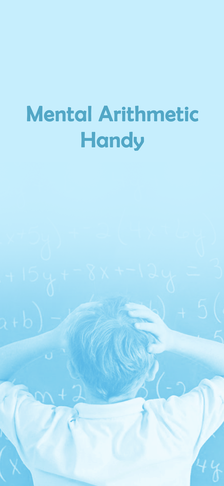

# MentalArithmeticHandy

Mental Arithmetic App. Built with React Native

     
     
     

## Development Process

    `cd MentalArithmeticHandy`

    `yarn install`

    `react-native run-ios`

## License

This program is free software: you can redistribute it and/or modify it under the terms of the GNU Affero General Public License as published by the Free Software Foundation, either version 3 of the License, or (at your option) any later version.

### Support

Let me know if you are interested
- Skype: live:.cid.3ffafb5602809e3f
- Instagram: sundong.exideatech
- LinkedIn: https://www.linkedin.com/in/sun-dong-82966617a/